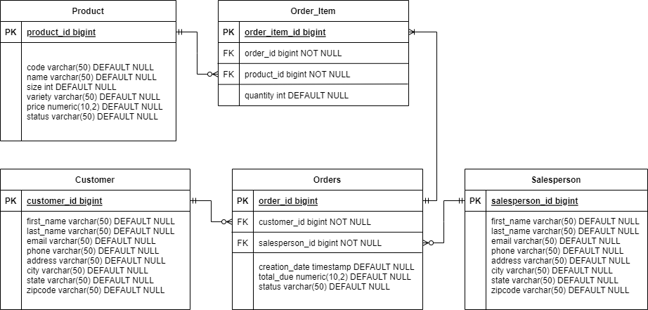

# Introduction
This application is a practice/example/exercise of JDBC techniques, using PSQL as the database, which is accessed through this Java Maven app. The connection is made using JDBC implementations of DAO and DTO, which we use to query tables with sql script and obtain readable data. The database is created in postgres using Lynda/Linkedin Learning-provided sql scripts.

# Implementation
Database is generated with given sql scripts.
## ER Diagram

## Design Patterns
The JDBC connection design utilizes DAO and DTO interfaces greatly, alongside a driver.\n
To summarize, the driver (in this case DatabaseConnectionManager class) creates and handles the connection to the database itself. Then, java creates and accesses a pre-defined DAO method to execute a query (in this case the customerDAO and OrderDAO classes). These queries (if they return tables) will return a resultset object, where the DAOs will convert into DTOs, or java object classes. These DTOs can then be accessed and used as common objects (such as calling toString for object readability). 
 
The driver classes of JDBC is mostly self-contained and holds the connection properties for the database. Technically speaking, the computing cost of creating and closing of connections are higher than maintaining the connection- so it is better to keep and maintain the driver for as long as the database may be needed, rather than opening and closing connections frequently as per need-of-use-basis. 
 
The DAOs are typically where most of the work goes into- DTOs need to have pre-defined methods to provide sql queries and translated from resultset to DAOs, as needed. In each of these methods, a string sql query is executed on the connection the DTO is based off, which typically returns a resultset, which is the table returned from sql. This resultset is raw data, and must be assigned into DAO objects manually in the code, before returning it. DAOs are created and interacted as objects, with methods that output DTO objects. 
 
DTOs are java objects representing entities. While usually 1-to-1 with the table schema in the database, you are free to change them as needed- for example, making them a join table instead, or having a list of other DAOs in their property, which is representative of a one-to-many relationship in a relational DB.

# Test
Manual testing using bash psql commands to verify sql queries, commands and results. 
Java debug done using logger to log DTO from DAO methods.
