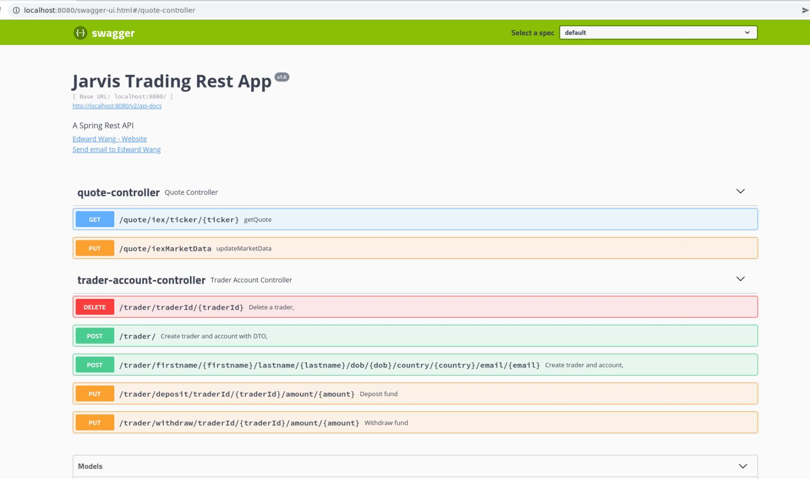

Table of contents
* [Introduction](#Introduction)
* [Quick Start](#Quick_Start)
* [Implementation](#Implementation)
* [Rest API Usage](#Rest_API_Usage)
* [Test](#Test)
* [Deployment](#Deployment)
* [Improvements](#Improvements)

# Introduction
This springboot application is the proof of concept for a new version of Jarvis Trading Application, which has the ability to source the stock market data from IEXCloud and update the application's database info. Using an external, independent postgres database to maintain a stateless property, this application allows the lookup/search for simplified/relevant stock market tickers, the creation (and deletion) of trader accounts, use of associated funds account, and the trading of stocks using those accounts. This application is built with a three-tier architecture, and uses Springboot as its base, alongside with running the Tomcat webservlet. Some of the application's API endpoints may be accessed using SwaggerUI.

# Quick Start
- Prequiresites: Docker, CentOS 7
- create a docker network: sudo docker network create trading-net
- Docker scripts:
	- /psql/Dockerfile: initiates psql database, initiate tables using .sql script
		- build image:
			cd ./springboot/psql 
			docker build -t trading-psql . 
			docker image ls -f reference=trading-psql 
	- /Dockerfile: compiles and builds app jar, create image
		- build image:
			cd ./springboot/ 
			docker build -t trading-app .  
			docker image ls -f reference=trading-psql  
  - start containers:
  	docker run --name trading-psql-dev \ 
	-e POSTGRES_PASSWORD=password \ 
	-e POSTGRES_DB=jrvstrading \ 
	-e POSTGRES_USER=postgres \ 
	--network trading-net \ 
	-d -p 5432:5432 trading-psql 

	IEX_PUB_TOKEN="your_token" 
	docker run --name trading-app-dev \ 
	-e "PSQL_URL=jdbc:postgresql://trading-psql-dev:5432/jrvstrading" \ 
	-e "PSQL_USER=postgres" \ 
	-e "PSQL_PASSWORD=password" \ 
	-e "IEX_PUB_TOKEN=${IEX_PUB_TOKEN}" \ 
	--network trading-net \ 
	-p 8080:8080 -t trading-app 
- Try trading-app with SwaggerUI: localhost/8080

# Implemenation
## Architecture
- Draw a component diagram that contains controllers, services, DAOs, SQL, IEX Cloud, WebServlet/Tomcat, HTTP client, and SpringBoot. (you must create your own diagram)
- Components Overview
  - Controller layer: Handles communication/relaying information towards interfaces/user endpoints, provides managed selective access to functionalities.
  - Service layer: Handles the business logic, processes and implementation of functions.
  - DAO layer: Storage and entities, representing real entities in programmatically understandable manner.
  - SpringBoot: Runs and manages webservlet/TomCat and IoC of application.
  - PSQL and IEX: PSQL serves as independent external storage, permitting the application proper to become stateless. IEX serves as an external data source, used to retrieve up-to-date business relevant data.

## REST API Usage
### Swagger
Swagger automatically describes the structure of the API so that machines can read them. In this case, swagger is useful for testing the API's endpoints and to simulate API usage.
### Quote Controller
- High-level description for this controller. Where is market data coming from (IEX) and how did you cache the quote data (PSQL). Briefly talk about data from within your app
- briefly explain each endpoint
  e.g.
  - GET `/quote/dailyList`: list all securities that are available to trading in this trading system blah..blah..
### Trader Controller
- High-level description for trader controller (e.g. it can manage trader and account information. it can deposit and withdraw fund from a given account)
- briefly explain each endpoint
### Order Controller
- High-level description for this controller.
- briefly explain each endpoint
### App controller
- briefly explain each endpoint
### Optional(Dashboard controller)
- High-level description for this controller.
- briefly explain each endpoint

# Test 
The application is tested with JUnit and integration tests on code level, while SwaggerUI is used to verify endpoints and program outputs. Code coverage class is 68% while methods coverage is 79%. The relatively low coverage is expected since the usage of interfaces and abstract classes together with the proof-of-concept nature of the application results in several unused or stub methods and redundant/inappropriate functions.

# Deployment
The application is saved on github and dockerizable with dockerfiles.
- PSQL Dockerfile initiates psql, then executes the .sql file in the sql_ddl folder to initiate the necessary tables. 
- Base Dockerfile compiles and creates a .jar of the application, which is next wrapped into an image.

# Improvements
- Inclusion of all components
- Remove redundant/stub functions/endpoints
- Implement an overview system/class for greater oversight/admin view
